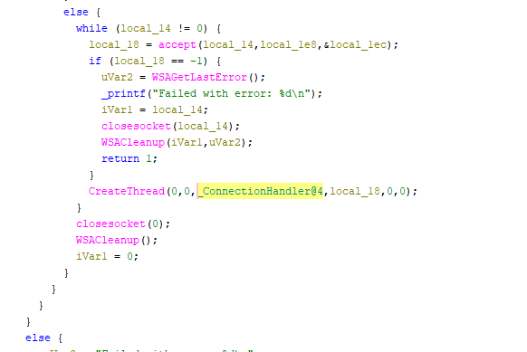
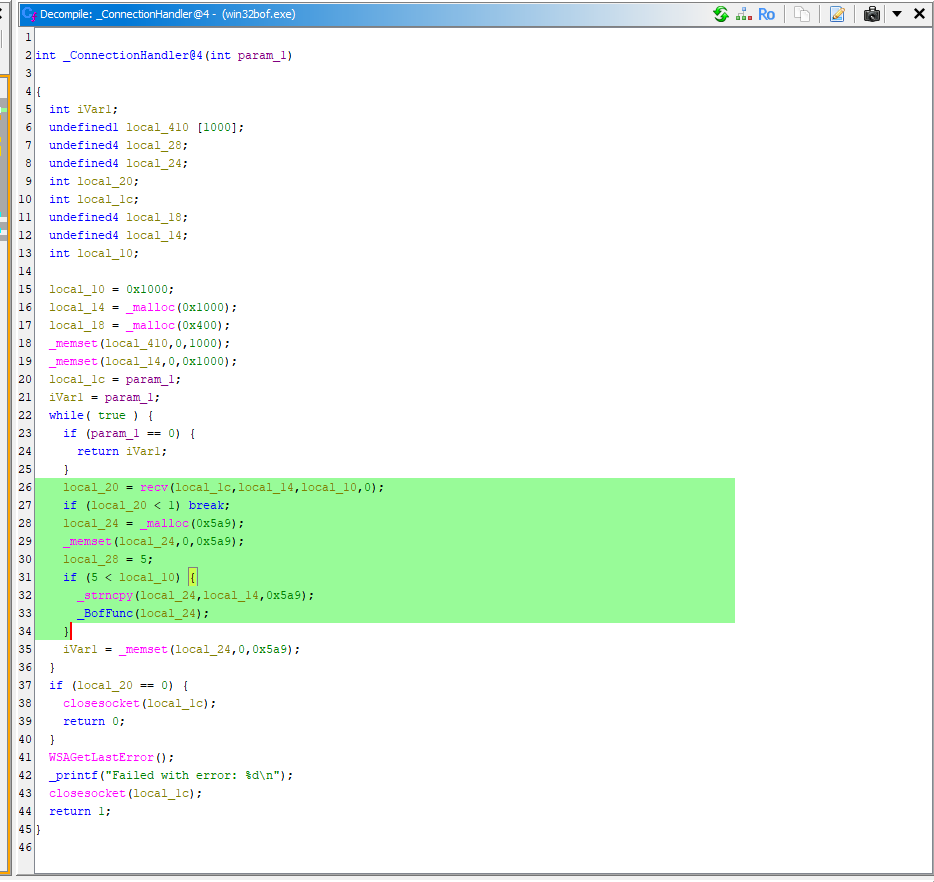
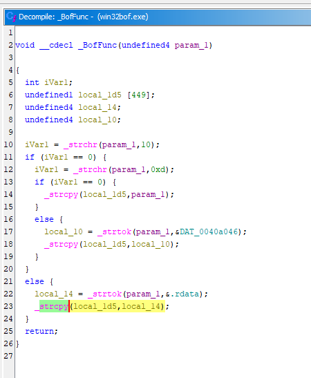

# HTB Academy - Stack-Based Buffer Overflow Study 

This repository contains Python scripts developed upon completing the Buffer Overflows module on **Hack The Box (HTB) Academy**.

The goal of this project is to document and structure the standard methodology for exploiting *Stack-Based Buffer Overflow* vulnerabilities, applying theoretical concepts across three controlled lab scenarios.

##  Lab Targets
The exploitation methodology was studied, adapted, and applied to the following vulnerable binaries during the module:
1. **CD Extract**
2. **CloudMe**
3. **Win32bof**

## ⚙️ Methodology Structured in the Scripts
For each target, the scripts document the following attack phases:
- `fuzz()`: Structure for sending incremental bytes to discover the crash point.
- `eip_offset()`: Structure to locate the exact offset required to gain control of the EIP register.
- `bad_chars()`: Function to help identify restricted characters that prevent the payload from executing in memory.
- `exploit()`: Final structure for delivering the generated payload.

##  Technologies & Tools Used
- Python 3 (Sockets)
- Debuggers (x64dbg / Immunity Debugger)
- Metasploit Framework (msfvenom)

##  Disclaimer
**For educational purposes only.** 
These scripts were created strictly for learning and practicing concepts taught on Hack The Box Academy. They are designed specifically for the vulnerable lab environment provided by the platform. **Do not use these techniques or codes on systems, networks, or applications you do not have explicit and documented permission to test.**

## 🔬 Root Cause Analysis (Reverse Engineering)
During the study, the vulnerable binary was analyzed using **Ghidra** to understand the exact point of failure at the source code level. 

As seen in the decompiled code below, the vulnerability is caused by unsafe memory operations inside the connection handler. The application copies the incoming payload into a fixed-size stack buffer without bounds checking, leading to the EIP overwrite.

**1. Network setup and thread creation (main):**

**2. Finding the vulnerable function call (Connection Handler):**

**3. The exact point of failure (Buffer Overflow in BofFunc):**

